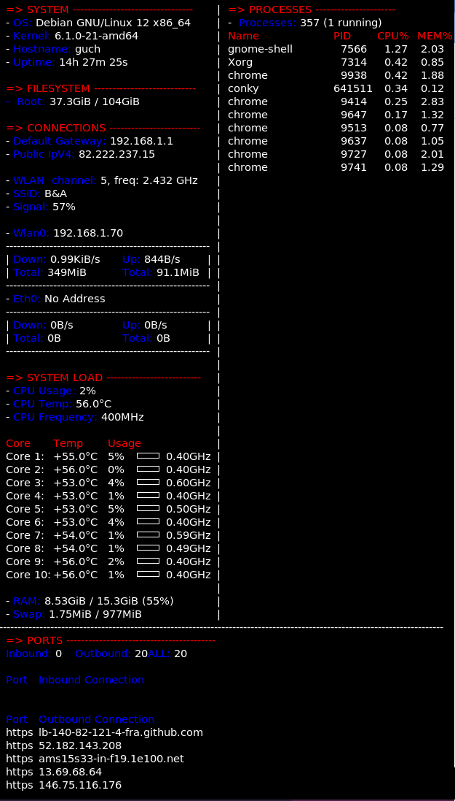

# conky-config

An Alternative Config for Conky

This is my config file I use in my personal Debian computer. Feel free to use it yourself!!

## Installation

By default the configuration file location is ~/.config/conky/conky.conf.

- If there is no such folder and/or file, first create a "conky" folder inside the ".config" directory.
- Download the conky.conf file and place it in the "conky" folder.

That's all.

## Screenshot

